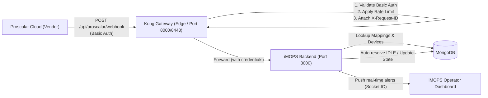
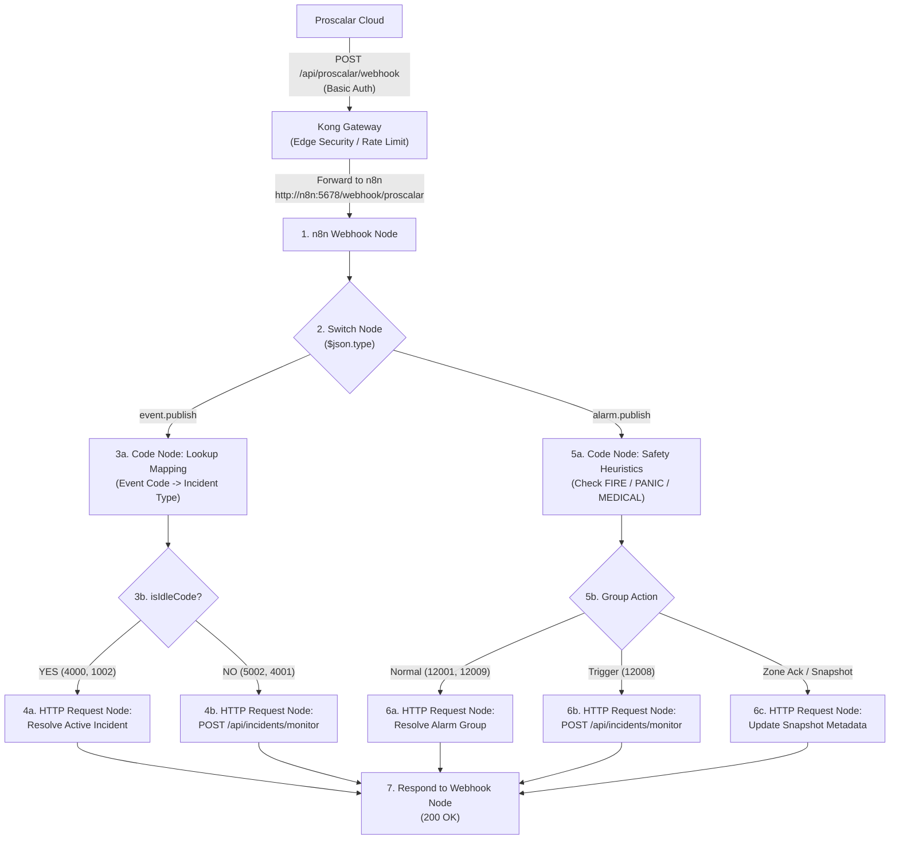

# Kong Gateway & n8n Integration Instructions: Proscalar Ingestion

This document provides complete instructions for configuring **Kong Gateway** in front of **iMOPS Lite** to ingest vendor webhooks from **Proscalar**. It covers two architectural approaches:
* **PART 1 (Option A):** Kong Gateway Perimeter (Direct iMOPS Adapter — Zero Backend Code Changes)
* **PART 2 (Option C):** Kong Gateway + n8n Visual Workflow Engine Pattern

---

# PART 1: Option A — Kong Gateway Perimeter (Direct iMOPS Adapter)

## 1. Architecture Overview

In this pattern, Kong acts as a hardened perimeter gateway. It terminates external connections, authenticates incoming requests, enforces rate limits and security policies, and forwards verified traffic directly to the existing iMOPS webhook route.



### Key Benefits

- **Zero iMOPS Code Changes:** By preserving incoming authentication headers (`hide_credentials: false`), the backend logic in `routes/proscalar.js` continues to function as implemented and tested.
- **Perimeter Defense:** Kong absorbs invalid authentication attempts, DoS floods, and oversized payloads before they reach Node.js.
- **Observability:** Centralized metrics, correlation IDs, and access logging at the gateway layer.

---

## 2. Declarative Configuration (`kong.yml` / DB-less Mode)

If using Kong in **declarative (DB-less)** mode, place this configuration in your Kong deployment (e.g., `/etc/kong/kong.yml`):

```yaml
_format_version: '3.0'

# ═══════════════════════════════════════════════════════════════════════════
# SERVICES & ROUTES
# ═══════════════════════════════════════════════════════════════════════════
services:
  - name: imops-proscalar-service
    # URL to the internal iMOPS backend service inside the Docker/K8s network
    url: http://backend:3000/api/proscalar/webhook
    connect_timeout: 5000
    write_timeout: 10000
    read_timeout: 10000
    routes:
      - name: proscalar-webhook-route
        paths:
          - /api/proscalar/webhook
        methods:
          - POST
        strip_path: false
        protocols:
          - http
          - https

    plugins:
      # 1. Edge Basic Authentication
      - name: basic-auth
        config:
          hide_credentials: false # CRITICAL: Retains Authorization header for iMOPS backend validation
          anonymous: null

      # 2. Rate Limiting (Prevents alert flooding / DDoS)
      - name: rate-limiting
        config:
          minute: 120
          hour: 3000
          policy: local
          fault_tolerant: true
          hide_client_headers: false

      # 3. Request Size Restriction (Rejects oversized payloads)
      - name: request-size-limiting
        config:
          allowed_payload_size: 5 # Limit to 5 MB

      # 4. Distributed Tracing & Correlation ID
      - name: correlation-id
        config:
          header_name: X-Request-ID
          generator: uuid
          echo_downstream: true

      # 5. (Optional) IP Restriction: Allow only Proscalar static IP ranges
      # - name: ip-restriction
      #   config:
      #     allow:
      #       - 203.0.113.0/24
      #       - 198.51.100.50

# ═══════════════════════════════════════════════════════════════════════════
# CONSUMERS & CREDENTIALS
# ═══════════════════════════════════════════════════════════════════════════
consumers:
  - username: proscalar_webhook_client
    custom_id: vendor-proscalar-tu
    basicauth_credentials:
      - username: proscalar@gmail.com
        password: '${PROSCALAR_PASS}' # Injected via environment or vault secret
```

---

## 3. Alternative: Provisioning via Kong Admin API (cURL Commands)

If you are using Kong with a database (PostgreSQL) or administering it via the **Admin API** (`http://localhost:8001`), run these commands:

### Step 1: Create the Upstream Service

* **Windows PowerShell:**
  ```powershell
  curl.exe -i -X POST http://localhost:8001/services `
    --data "name=imops-proscalar-service" `
    --data "url=http://backend:3000/api/proscalar/webhook"
  ```
* **Linux / Git Bash:**
  ```bash
  curl -i -X POST http://localhost:8001/services \
    --data name=imops-proscalar-service \
    --data url=http://backend:3000/api/proscalar/webhook
  ```

---

### Step 2: Create the Route

* **Windows PowerShell:**
  ```powershell
  curl.exe -i -X POST http://localhost:8001/services/imops-proscalar-service/routes `
    --data "name=proscalar-webhook-route" `
    --data "paths[]=/api/proscalar/webhook" `
    --data "methods[]=POST" `
    --data "strip_path=false"
  ```
* **Linux / Git Bash:**
  ```bash
  curl -i -X POST http://localhost:8001/services/imops-proscalar-service/routes \
    --data name=proscalar-webhook-route \
    --data 'paths[]=/api/proscalar/webhook' \
    --data 'methods[]=POST' \
    --data strip_path=false
  ```

---

### Step 3: Enable Basic Auth Plugin

* **Windows PowerShell:**
  ```powershell
  curl.exe -i -X POST http://localhost:8001/routes/proscalar-webhook-route/plugins `
    --data "name=basic-auth" `
    --data "config.hide_credentials=false"
  ```
* **Linux / Git Bash:**
  ```bash
  curl -i -X POST http://localhost:8001/routes/proscalar-webhook-route/plugins \
    --data name=basic-auth \
    --data config.hide_credentials=false
  ```

---

### Step 4: Enable Rate Limiting Plugin

* **Windows PowerShell:**
  ```powershell
  curl.exe -i -X POST http://localhost:8001/routes/proscalar-webhook-route/plugins `
    --data "name=rate-limiting" `
    --data "config.minute=120" `
    --data "config.policy=local"
  ```
* **Linux / Git Bash:**
  ```bash
  curl -i -X POST http://localhost:8001/routes/proscalar-webhook-route/plugins \
    --data name=rate-limiting \
    --data config.minute=120 \
    --data config.policy=local
  ```

---

### Step 5: Enable Correlation ID Plugin

* **Windows PowerShell:**
  ```powershell
  curl.exe -i -X POST http://localhost:8001/routes/proscalar-webhook-route/plugins `
    --data "name=correlation-id" `
    --data "config.header_name=X-Request-ID" `
    --data "config.generator=uuid" `
    --data "config.echo_downstream=true"
  ```
* **Linux / Git Bash:**
  ```bash
  curl -i -X POST http://localhost:8001/routes/proscalar-webhook-route/plugins \
    --data name=correlation-id \
    --data config.header_name=X-Request-ID \
    --data config.generator=uuid \
    --data config.echo_downstream=true
  ```

---

### Step 6: Create Consumer & Credentials

* **Windows PowerShell:**
  ```powershell
  # 1. Create Consumer
  curl.exe -i -X POST http://localhost:8001/consumers `
    --data "username=proscalar_webhook_client" `
    --data "custom_id=vendor-proscalar-tu"

  # 2. Attach Basic Auth credentials
  curl.exe -i -X POST http://localhost:8001/consumers/proscalar_webhook_client/basic-auth `
    --data "username=proscalar@gmail.com" `
    --data "password=YOUR_SECURE_PROSCALAR_PASSWORD"
  ```
* **Linux / Git Bash:**
  ```bash
  # 1. Create Consumer
  curl -i -X POST http://localhost:8001/consumers \
    --data username=proscalar_webhook_client \
    --data custom_id=vendor-proscalar-tu

  # 2. Attach Basic Auth credentials
  curl -i -X POST http://localhost:8001/consumers/proscalar_webhook_client/basic-auth \
    --data username=proscalar@gmail.com \
    --data password="YOUR_SECURE_PROSCALAR_PASSWORD"
  ```

---

## 4. Docker Compose Setup (Kong DB-less Mode)

To run Kong Gateway in DB-less mode directly alongside the iMOPS stack in `docker-compose.yml`:

```yaml
version: '3.8'

services:
  kong-gateway:
    image: kong:3.4-alpine
    container_name: kong-gateway
    restart: unless-stopped
    environment:
      KONG_DATABASE: 'off'
      KONG_DECLARATIVE_CONFIG: /etc/kong/kong.yml
      KONG_PROXY_ACCESS_LOG: /dev/stdout
      KONG_ADMIN_ACCESS_LOG: /dev/stdout
      KONG_PROXY_ERROR_LOG: /dev/stderr
      KONG_ADMIN_ERROR_LOG: /dev/stderr
      KONG_ADMIN_LISTEN: 0.0.0.0:8001
      KONG_PROXY_LISTEN: 0.0.0.0:8000, 0.0.0.0:8443 ssl
      PROSCALAR_PASS: ${PROSCALAR_PASS:-proscalar_secure_pass_123}
    volumes:
      - ./docker/kong.yml:/etc/kong/kong.yml:ro
    ports:
      - '8000:8000' # HTTP Ingress Proxy
      - '8443:8443' # HTTPS Ingress Proxy
      - '127.0.0.1:8001:8001' # Admin API (Internal only)
    depends_on:
      - backend
    networks:
      - imops-network

networks:
  imops-network:
    driver: bridge
```

---

## 5. Verification & Testing

Run these tests against the Kong Gateway proxy port (default `8000` or `8088`):

### Test 1: Unauthorized Request (Should return 401 from Kong)

* **Windows PowerShell:**
  ```powershell
  curl.exe -i -X POST http://localhost:8088/api/proscalar/webhook `
    -H "Content-Type: application/json" `
    -d '{"type":"event.publish"}'
  ```
* **Linux / Git Bash:**
  ```bash
  curl -i -X POST http://localhost:8088/api/proscalar/webhook \
    -H "Content-Type: application/json" \
    -d '{"type":"event.publish"}'
  ```

- **Expected Result:** `HTTP/1.1 401 Unauthorized` generated directly by Kong (Node.js backend is untouched).

---

### Test 2: Valid Active Event (Should create incident)

* **Windows PowerShell:**
  ```powershell
  curl.exe -i -X POST http://localhost:8088/api/proscalar/webhook `
    -u "proscalar@gmail.com:fwpkyjcf2i8fcoP05yEz" `
    -H "Content-Type: application/json" `
    -d "@c:/Projects/cde/apigw/scripts/fixtures/event_5002.json"
  ```
* **Linux / Git Bash:**
  ```bash
  curl -i -X POST http://localhost:8088/api/proscalar/webhook \
    -u "proscalar@gmail.com:fwpkyjcf2i8fcoP05yEz" \
    -H "Content-Type: application/json" \
    -d '{
      "type": "event.publish",
      "timestamp": "2026-06-09T03:00:00.000Z",
      "data": {
        "id": "kong-test-event-01",
        "eventTimestamp": "2026-06-09T02:59:58.000Z",
        "eventCode": "5002",
        "eventSourceId": "proscalar-test-source-id",
        "eventSourceName": "OT-CTR-MAIN GATE",
        "eventPointId": "proscalar-test-point-id",
        "eventPointName": "OT-MAIN GATE",
        "message": "Logical Door Forced Open ACTIVE."
      }
    }'
  ```

- **Expected Result:** `HTTP/1.1 200 OK` with JSON `{ "success": true, "forwardResult": { ... } }` and response header `X-Request-ID`.
- Check iMOPS operator dashboard: **Door Force Opened** active incident appears with SOP checklist.

---

### Test 3: Auto-Resolution IDLE Event (Should resolve active incident)

* **Windows PowerShell:**
  ```powershell
  curl.exe -i -X POST http://localhost:8088/api/proscalar/webhook `
    -u "proscalar@gmail.com:fwpkyjcf2i8fcoP05yEz" `
    -H "Content-Type: application/json" `
    -d "@c:/Projects/cde/apigw/scripts/fixtures/event_4000.json"
  ```
* **Linux / Git Bash:**
  ```bash
  curl -i -X POST http://localhost:8088/api/proscalar/webhook \
    -u "proscalar@gmail.com:fwpkyjcf2i8fcoP05yEz" \
    -H "Content-Type: application/json" \
    -d '{
      "type": "event.publish",
      "timestamp": "2026-06-09T03:05:00.000Z",
      "data": {
        "id": "kong-test-event-02",
        "eventTimestamp": "2026-06-09T03:04:58.000Z",
        "eventCode": "4000",
        "eventSourceId": "proscalar-test-source-id",
        "eventSourceName": "OT-CTR-MAIN GATE",
        "eventPointId": "proscalar-test-point-id",
        "eventPointName": "CV485",
        "message": "Logical Reader Tamper IDLE."
      }
    }'
  ```

- **Expected Result:** `HTTP/1.1 200 OK` with JSON `{ "success": true, "message": "Incident automatically resolved successfully" }`.

---

### Test 4: Rate Limiting Enforcement

Send > 120 requests within 1 minute:

* **Windows PowerShell:**
  ```powershell
  1..125 | ForEach-Object {
    curl.exe -s -o NUL -w "%{http_code}`n" -X POST http://localhost:8088/api/proscalar/webhook `
      -u "proscalar@gmail.com:fwpkyjcf2i8fcoP05yEz" `
      -H "Content-Type: application/json" `
      -d "@c:/Projects/cde/apigw/scripts/fixtures/ping.json"
  }
  ```
* **Linux / Git Bash:**
  ```bash
  for i in {1..125}; do
    curl -s -o /dev/null -w "%{http_code}\n" -X POST http://localhost:8088/api/proscalar/webhook \
      -u "proscalar@gmail.com:fwpkyjcf2i8fcoP05yEz" \
      -H "Content-Type: application/json" \
      -d '{"type":"ping"}'
  done
  ```

- **Expected Result:** `HTTP/1.1 429 Too Many Requests` returned by Kong with `RateLimit-Remaining: 0`.

---

## 6. Checklist & Summary (Option A)

- [x] Kong handles edge Basic Auth validation.
- [x] Kong retains `Authorization` header (`hide_credentials: false`) so iMOPS backend needs zero code changes.
- [x] Rate limiting protects backend from webhook storms.
- [x] Correlation IDs (`X-Request-ID`) trace logs across Kong and backend.
- [x] Backend handles all stateful logic: DB lookup tables, device matching, IDLE auto-resolution, and Socket.IO broadcasts.

---
---

# PART 2: Option C — Kong Gateway + n8n Workflow Engine Pattern

Option C shifts the webhook payload ingestion, routing, and normalization logic from the Node.js backend into an **n8n visual workflow**, while Kong remains the perimeter gatekeeper.



---

### 7.1 Workflow Architecture: How Many Workflows to Create?

You have two structural approaches in n8n:

#### Approach 1: 1 Single Unified Workflow (Recommended ⭐)
* **Count:** **1 Workflow**
* **Why:** Proscalar only targets **one single incoming webhook endpoint URL**. Having all logic in one canvas provides the lowest latency, eliminates inter-workflow messaging overhead, and allows visual end-to-end tracing of every alarm event in one execution log.
* **Nodes Required (~8–10 nodes):**
  1. `Webhook Trigger Node`: Ingests payload from Kong.
  2. `Switch Node`: Routes `event.publish` vs. `alarm.publish`.
  3. `Code Node (Event Code Map)`: Evaluates `eventCode` against lookup table and checks `isIdleCode`.
  4. `IF Node (Idle vs Active)`: Directs to resolution or creation.
  5. `Code Node (Safety Heuristic)`: Evaluates `accessZones` array for `FIRE`, `PANIC`, `MEDICAL`.
  6. `HTTP Request Node (Create Incident)`: Dispatches to `POST /api/incidents/monitor`.
  7. `HTTP Request Node (Resolve Incident)`: Auto-closes active incident in iMOPS.
  8. `Respond to Webhook Node`: Returns `{ "success": true }`.

#### Approach 2: 3 Modular Workflows (Enterprise Sub-Workflow Pattern)
If you prefer strict separation of concerns:
* **Workflow 1: Ingestor & Router** (Receives webhook from Kong, validates envelope, calls sub-workflow via *Execute Workflow* node).
* **Workflow 2: Point & Tamper Processor** (Dedicated to single-device access, tamper, and hardware events).
* **Workflow 3: Alarm Group & Fire Processor** (Dedicated to multi-zone aggregation, fire safety rules, and ACK states).

---

### 7.2 Kong Configuration for Option C (`kong.yml`)

In Option C, Kong routes the external webhook directly to the n8n webhook service instead of the Node.js backend:

```yaml
_format_version: "3.0"

services:
  - name: n8n-proscalar-service
    # Upstream pointing to internal n8n container
    url: http://n8n:5678/webhook/proscalar
    connect_timeout: 5000
    write_timeout: 10000
    read_timeout: 10000
    routes:
      - name: proscalar-n8n-route
        paths:
          - /api/proscalar/webhook
        methods:
          - POST
        strip_path: true
    plugins:
      # Edge Basic Auth (validates vendor credentials at the perimeter)
      - name: basic-auth
        config:
          hide_credentials: true  # Strips vendor credentials before forwarding to n8n
      # Rate Limiting
      - name: rate-limiting
        config:
          minute: 120
          policy: local
      # Inject internal service token for n8n to call iMOPS API
      - name: request-transformer
        config:
          add:
            headers:
              - "X-Source: Kong-Proscalar-Gateway"

consumers:
  - username: proscalar_webhook_client
    basicauth_credentials:
      - username: proscalar@gmail.com
        password: "${PROSCALAR_PASS}"
```

---

### 7.3 Detailed n8n Node Logic & Code Snippets

#### 1. Code Node: Event Code Lookup & Classification (`event.publish`)
```javascript
// n8n Code Node for event.publish
const data = $json.data || {};
const eventCode = String(data.eventCode || '');

// Proscalar code mappings
const mappingTable = {
  "5001": { incidentType: "door_held_open", severity: "medium", isIdle: false },
  "5002": { incidentType: "door_forced_open", severity: "high", isIdle: false },
  "4001": { incidentType: "reader_tamper", severity: "high", isIdle: false },
  "4000": { incidentType: "reader_tamper", severity: "low", isIdle: true, pairCode: "4001" },
  "1003": { incidentType: "panel_tamper", severity: "critical", isIdle: false },
  "1002": { incidentType: "panel_tamper", severity: "low", isIdle: true, pairCode: "1003" },
  "1000": { incidentType: "power_failure", severity: "high", isIdle: false },
  "5014": { incidentType: "emergency_exit", severity: "critical", isIdle: false },
  "5015": { incidentType: "emergency_exit", severity: "low", isIdle: true, pairCode: "5014" }
};

const mapping = mappingTable[eventCode] || { incidentType: "invalid_credential", severity: "medium", isIdle: false };

return [{
  json: {
    eventCode,
    isIdleCode: mapping.isIdle,
    activePairCode: mapping.pairCode || null,
    incidentType: mapping.incidentType,
    severity: mapping.severity,
    deviceName: data.eventPointName || data.eventSourceName || "Proscalar Device",
    title: `${data.message || mapping.incidentType} - ${data.eventPointName || 'Proscalar'}`,
    eventSourceId: data.eventSourceId,
    eventPointId: data.eventPointId,
    rawData: data
  }
}];
```

#### 2. Code Node: Alarm Group Safety Heuristics (`alarm.publish`)
```javascript
// n8n Code Node for alarm.publish
const data = $json.data || {};
const groupCode = String(data.groupEventCode || '');
const accessZones = data.accessZones || [];

// Check resolution codes
const isResolution = ['12001', '12009', '12015'].includes(groupCode);

// Safety Priority Heuristics
const isFire = accessZones.some(z => z.type === 'FIRE');
const isPanic = accessZones.some(z => z.type === 'PANIC');
const isMedical = accessZones.some(z => z.type === 'MEDICAL');

let incidentType = 'group_alarm';
if (isFire) incidentType = 'fire_alarm';
else if (isPanic) incidentType = 'panic_alarm';
else if (isMedical) incidentType = 'medical_alarm';

// Check if all non-safety zones are acknowledged
const allAck = accessZones.length > 0 && accessZones.every(z => z.state === 'ACKNOWLEDGED');

return [{
  json: {
    alarmGroupId: data.alarmGroupId,
    groupEventCode: groupCode,
    isResolution,
    isTrigger: groupCode === '12008',
    isSafetyCategory: (isFire || isPanic || isMedical),
    allAck,
    incidentType,
    severity: (isFire || isPanic || isMedical || groupCode === '12008') ? 'critical' : 'medium',
    title: `${data.name || 'ALARM GROUP'} - ${incidentType.toUpperCase()}`,
    deviceName: data.eventSourceName || data.name || "Alarm Monitoring Group",
    rawData: data
  }
}];
```

#### 3. HTTP Request Node: Create Active Incident
* **Method:** `POST`
* **URL:** `http://backend:3000/api/incidents/monitor`
* **Authentication:** Header `Authorization: Bearer {{ $env.INTERNAL_SERVICE_JWT }}`
* **Body (JSON):**
```json
{
  "incidentType": "={{ $json.incidentType }}",
  "deviceName": "={{ $json.deviceName }}",
  "title": "={{ $json.title }}",
  "severity": "={{ $json.severity }}",
  "preResolved": true,
  "mode": "incident",
  "metadata": {
    "proscalar_event_code": "={{ $json.eventCode }}",
    "proscalar_alarm_group_id": "={{ $json.alarmGroupId }}",
    "proscalar_raw_data": "={{ $json.rawData }}"
  }
}
```

---

### 7.4 Summary Comparison: Option A vs. Option C

| Feature | Option A (Kong + Backend Adapter) | Option C (Kong + n8n Workflow) |
| :--- | :--- | :--- |
| **Workflows to Manage** | **0** (Code already implemented & tested) | **1 unified workflow** (or 3 modular workflows) |
| **iMOPS Code Changes** | **None** | Minor (need an explicit incident resolution API endpoint if not modifying DB directly) |
| **Alarm Dispatch Latency** | **< 20 ms** (Optimal for Fire & Tamper alarms) | **150 ms – 400 ms** (Node pipeline overhead in n8n) |
| **Visual Debugging** | Container logs & DB AuditLog | n8n visual execution logs per webhook |
| **Failure Surface** | Kong $\rightarrow$ iMOPS (2 services) | Kong $\rightarrow$ n8n $\rightarrow$ iMOPS (3 services) |

---

## 8. Option C Operational Runbook & Production Artifacts

The Option C integration is fully implemented and operational in this repository.

### 8.1 Repository Deliverables

| Artifact | Path | Description |
| :--- | :--- | :--- |
| **Kong Setup (PowerShell)** | [`apigw/scripts/setup_proscalar_n8n.ps1`](file:///c:/Projects/cde/apigw/scripts/setup_proscalar_n8n.ps1) | Automated script provisioning Service, Route, 5 Edge Plugins, and Consumer Credentials |
| **Kong Setup (Bash)** | [`apigw/scripts/setup_proscalar_n8n.sh`](file:///c:/Projects/cde/apigw/scripts/setup_proscalar_n8n.sh) | Linux / CI-CD equivalent setup script |
| **Vendor API Specification**| [`docs/proscalar_kong_api_integration_guide.md`](file:///c:/Projects/cde/docs/proscalar_kong_api_integration_guide.md) | Official external vendor & developer integration guide for the 6 webhook calls |
| **n8n Workflow Definition** | [`n8n/workflows/proscalar_ingestion_workflow.json`](file:///c:/Projects/cde/n8n/workflows/proscalar_ingestion_workflow.json) | Complete exportable visual workflow with event/alarm branching and classification |
| **Windows curl Suite (Batch/CMD)** | [`apigw/scripts/test_proscalar_curl.bat`](file:///c:/Projects/cde/apigw/scripts/test_proscalar_curl.bat) | Windows 1-click Command Prompt test runner using native `curl.exe` |
| **Windows curl Suite (PowerShell)**| [`apigw/scripts/test_proscalar_curl.ps1`](file:///c:/Projects/cde/apigw/scripts/test_proscalar_curl.ps1) | Windows PowerShell test runner using native `curl.exe` with colored output |
| **Postman 6-Call Runner (Batch)** | [`apigw/scripts/test_imops_proscalar_collection.bat`](file:///c:/Projects/cde/apigw/scripts/test_imops_proscalar_collection.bat) | 1-Click Windows batch runner for all 6 requests in `imops_proscalar.json` |
| **Postman 6-Call Runner (PS1)**   | [`apigw/scripts/test_imops_proscalar_collection.ps1`](file:///c:/Projects/cde/apigw/scripts/test_imops_proscalar_collection.ps1) | PowerShell test runner for individual or batch testing of `imops_proscalar.json` |
| **Payload Fixtures** | [`apigw/scripts/fixtures/`](file:///c:/Projects/cde/apigw/scripts/fixtures/) | Standalone test JSON payloads (`event_5002.json`, `event_4000.json`, `alarm_12008.json`, `ping.json`) |
| **Verification Suite (PowerShell)**| [`apigw/scripts/test_proscalar_n8n.ps1`](file:///c:/Projects/cde/apigw/scripts/test_proscalar_n8n.ps1) | Invoke-RestMethod test runner for PowerShell |
| **Verification Suite (Bash)** | [`apigw/scripts/test_proscalar_n8n.sh`](file:///c:/Projects/cde/apigw/scripts/test_proscalar_n8n.sh) | cURL-based test suite for Linux / Git Bash |

---

### 8.2 Deployment & Provisioning Instructions

#### Step 1: Provision / Configure Kong Gateway Service

Kong Gateway receives incoming vendor webhooks on port `8088` and forwards them to n8n's webhook ingress on port `5678`.

##### Method A: Via Kong Manager UI (`http://<KONG_HOST>:8002`)
1. Open **`http://<KONG_HOST>:8002`** (e.g. `http://10.99.32.55:8002`) in your browser.
2. In the left sidebar, click **Gateway Services**.
3. Click **`imops-proscalar-n8n-service`** (or click **New Gateway Service** if not yet created).
4. Click the blue **Edit** button in the top right.
5. In the **Service Endpoint** section, configure the target n8n instance:
   - **Protocol:** `http` *(recommended when Kong and n8n share `cde-network`)*
   - **Host:** `n8n-server` *(or `10.99.32.55` if connecting over external LAN IP)*
   - **Port:** `5678`
   - **Path:** `/webhook/proscalar`
   > [!NOTE]
   > If using `https` with LAN IP `10.99.32.55`, click **View Advanced Fields**, scroll down, and ensure **TLS Verify** is **unchecked** (to allow self-signed certificates).
6. Click **Save**.
7. **Verify Route:** Click the **Routes** tab $\rightarrow$ **`proscalar-webhook-route`** $\rightarrow$ verify path is `/api/proscalar/webhook` and methods include `POST`.
8. The external endpoint for webhook callers is:
   ```text
   POST http://<KONG_HOST>:8088/api/proscalar/webhook
   ```

##### Method B: Via CLI Script or cURL
Run the automated script to provision the service, route, credentials, and plugins:
```bash
# In Linux / Bash:
bash c:/Projects/cde/apigw/scripts/setup_proscalar_n8n.sh http://n8n-server:5678/webhook/proscalar

# Or Windows PowerShell:
powershell -ExecutionPolicy Bypass -File c:\Projects\cde\apigw\scripts\setup_proscalar_n8n.ps1 -N8nUpstreamUrl "http://n8n-server:5678/webhook/proscalar"
```
Or update an existing service directly via Admin API:
```bash
curl -i -X PATCH "http://localhost:8001/services/imops-proscalar-n8n-service" \
  -H "Content-Type: application/json" \
  -d '{"protocol":"http","host":"n8n-server","port":5678,"path":"/webhook/proscalar"}'
```

---

#### Step 2: Import & Publish n8n Pipeline

The pre-configured Taylor's University workflow targets iMOPS at `http://10.99.32.54:13000`.

##### Method A: Via n8n Web UI (`https://<N8N_HOST>:5678`)
1. Open **`https://10.99.32.55:5678`** in your browser (accept the self-signed SSL certificate warning).
2. Click **Workflows** in the left navigation sidebar.
3. In the upper-right corner, click the **`...`** (three dots) menu button $\rightarrow$ select **Import from File**.
4. Select the Taylor workflow file:
   - **[`n8n/workflows/proscalar_ingestion_workflow_taylor.json`](file:///c:/Projects/cde/n8n/workflows/proscalar_ingestion_workflow_taylor.json)**
5. Once imported, confirm the 4 HTTP Request nodes target `http://10.99.32.54:13000`:
   - `Create Point Incident` $\rightarrow$ `http://10.99.32.54:13000/api/incidents/monitor`
   - `Resolve Point Incident` $\rightarrow$ `http://10.99.32.54:13000/api/proscalar/webhook`
   - `Create Group Incident` $\rightarrow$ `http://10.99.32.54:13000/api/incidents/monitor`
   - `Resolve Group Incident` $\rightarrow$ `http://10.99.32.54:13000/api/proscalar/webhook`
6. Toggle the **Active** switch in the top-right corner to **ON (green)**.
7. Click **Save** (`Ctrl + S`).

##### Method B: Via Terminal CLI
Copy the workflow into the running container and publish:
```bash
# 1. Copy JSON into the container
docker cp n8n/workflows/proscalar_ingestion_workflow_taylor.json n8n-server:/tmp/workflow.json

# 2. Import into n8n SQLite database
docker exec n8n-server n8n import:workflow --input=/tmp/workflow.json

# 3. Publish and activate the workflow
docker exec n8n-server n8n publish:workflow --id=proscalar-pipeline-v1

# 4. Restart container to register active webhook listener
docker restart n8n-server
```

---

### 8.3 Verification & Testing

#### Method A: Automated Test Suite (1-Click)

Run the verification test suite on Windows using native `curl.exe`:

* **Option 1: Windows Command Prompt (CMD) or Double-Click Batch File:**
  ```cmd
  c:\Projects\cde\apigw\scripts\test_proscalar_curl.bat
  ```
* **Option 2: Windows PowerShell (using native `curl.exe`):**
  ```powershell
  powershell -ExecutionPolicy Bypass -File c:\Projects\cde\apigw\scripts\test_proscalar_curl.ps1
  ```
* **Option 3: Linux / Git Bash / macOS:**
  ```bash
  bash c:/Projects/cde/apigw/scripts/test_proscalar_n8n.sh
  ```

This automated suite tests:
- **Test 1:** Unauthorized Rejection (`HTTP 401 Unauthorized` directly from Kong edge).
- **Test 2:** Active Point Alert (`Code 5002 - Door Forced Open` -> incident created, Exec ID returned).
- **Test 3:** IDLE Auto-Resolution (`Code 4000 - Reader Tamper IDLE` -> incident resolved).
- **Test 4:** Alarm Group Safety Event (`Code 12008 with FIRE Zone` -> CRITICAL incident).
- **Test 5:** Gateway Rate Limiting (`120 req/min` threshold throttled with `HTTP 429`).

---

#### Method B: Manual Step-by-Step cURL Verification

You can run individual verification calls manually. Windows uses native `curl.exe` with payload fixture files to avoid shell escaping issues.

##### Test 1: Perimeter Security (Unauthorized Request)
Verify Kong blocks unauthenticated calls without forwarding downstream (`HTTP 401`):

* **Windows Command Prompt (CMD):**
  ```cmd
  curl.exe -i -X POST http://localhost:8088/api/proscalar/webhook ^
    -H "Content-Type: application/json" ^
    -d "{\"type\":\"event.publish\"}"
  ```
* **Windows PowerShell:**
  ```powershell
  curl.exe -i -X POST "http://localhost:8088/api/proscalar/webhook" `
    -H "Content-Type: application/json" `
    -d '{"type":"event.publish"}'
  ```
* **Linux / Git Bash:**
  ```bash
  curl -i -X POST http://localhost:8088/api/proscalar/webhook \
    -H "Content-Type: application/json" \
    -d '{"type":"event.publish"}'
  ```
* **Expected Result:** `HTTP/1.1 401 Unauthorized` with `Server: kong/3.9.3` and an `X-Request-ID` header.

---

##### Test 2: Active Alert (Door Forced Open — Code `5002`)
Send an active single-device event:

* **Windows Command Prompt (CMD):**
  ```cmd
  curl.exe -i -X POST http://localhost:8088/api/proscalar/webhook ^
    -u "proscalar@gmail.com:fwpkyjcf2i8fcoP05yEz" ^
    -H "Content-Type: application/json" ^
    -d @c:\Projects\cde\apigw\scripts\fixtures\event_5002.json
  ```
* **Windows PowerShell:**
  ```powershell
  curl.exe -i -X POST "http://localhost:8088/api/proscalar/webhook" `
    -u "proscalar@gmail.com:fwpkyjcf2i8fcoP05yEz" `
    -H "Content-Type: application/json" `
    -d "@c:/Projects/cde/apigw/scripts/fixtures/event_5002.json"
  ```
* **Linux / Git Bash:**
  ```bash
  curl -i -X POST http://localhost:8088/api/proscalar/webhook \
    -u "proscalar@gmail.com:fwpkyjcf2i8fcoP05yEz" \
    -H "Content-Type: application/json" \
    -d @apigw/scripts/fixtures/event_5002.json
  ```
* **Expected Result:** `HTTP/1.1 200 OK` with `{ "success": true, "pipeline": "Option C (Kong Gateway + n8n)", "executionId": "..." }`.
* **Backend Outcome:** Incident created in iMOPS backend (`Door Force Opened`), tagged to Taylor's University, with SOP checklist and real-time Socket.IO alert broadcast.

---

##### Test 3: Auto-Resolution Event (Reader Tamper IDLE — Code `4000`)
Send an IDLE restoration code:

* **Windows Command Prompt (CMD):**
  ```cmd
  curl.exe -i -X POST http://localhost:8088/api/proscalar/webhook ^
    -u "proscalar@gmail.com:fwpkyjcf2i8fcoP05yEz" ^
    -H "Content-Type: application/json" ^
    -d @c:\Projects\cde\apigw\scripts\fixtures\event_4000.json
  ```
* **Windows PowerShell:**
  ```powershell
  curl.exe -i -X POST "http://localhost:8088/api/proscalar/webhook" `
    -u "proscalar@gmail.com:fwpkyjcf2i8fcoP05yEz" `
    -H "Content-Type: application/json" `
    -d "@c:/Projects/cde/apigw/scripts/fixtures/event_4000.json"
  ```
* **Linux / Git Bash:**
  ```bash
  curl -i -X POST http://localhost:8088/api/proscalar/webhook \
    -u "proscalar@gmail.com:fwpkyjcf2i8fcoP05yEz" \
    -H "Content-Type: application/json" \
    -d @apigw/scripts/fixtures/event_4000.json
  ```
* **Expected Result:** `HTTP/1.1 200 OK`. Active incident matching pair code `4001` is marked resolved in iMOPS.

---

##### Test 4: Critical Multi-Zone Fire Alarm Group (Code `12008` with `FIRE` Zone)
Send an aggregated multi-zone alarm to test safety priority heuristics:

* **Windows Command Prompt (CMD):**
  ```cmd
  curl.exe -i -X POST http://localhost:8088/api/proscalar/webhook ^
    -u "proscalar@gmail.com:fwpkyjcf2i8fcoP05yEz" ^
    -H "Content-Type: application/json" ^
    -d @c:\Projects\cde\apigw\scripts\fixtures\alarm_12008.json
  ```
* **Windows PowerShell:**
  ```powershell
  curl.exe -i -X POST "http://localhost:8088/api/proscalar/webhook" `
    -u "proscalar@gmail.com:fwpkyjcf2i8fcoP05yEz" `
    -H "Content-Type: application/json" `
    -d "@c:/Projects/cde/apigw/scripts/fixtures/alarm_12008.json"
  ```
* **Linux / Git Bash:**
  ```bash
  curl -i -X POST http://localhost:8088/api/proscalar/webhook \
    -u "proscalar@gmail.com:fwpkyjcf2i8fcoP05yEz" \
    -H "Content-Type: application/json" \
    -d @apigw/scripts/fixtures/alarm_12008.json
  ```
* **Expected Result:** `HTTP/1.1 200 OK`. n8n classifies the event as `fire_alarm` with `CRITICAL` severity and dispatches an immediate high-priority alarm.

---

### 8.4 Visual Dashboards & Observability Guide

Both Kong Gateway and n8n provide web-based management dashboards to monitor traffic, inspect execution logs, and verify configuration state in real time.

#### Dashboard Access Matrix

| Dashboard | Access URL | Protocol | Auth / Login | Key Functions |
| :--- | :--- | :--- | :--- | :--- |
| **Kong Manager UI** | **[http://localhost:8002](http://localhost:8002)** | HTTP | None (OSS auto-connects to Admin API) | • Inspect Services, Routes & Consumers<br/>• View active Edge Plugins & Rate Limits<br/>• Monitor gateway traffic & error metrics |
| **n8n Workflow Canvas** | **[https://localhost:5678](https://localhost:5678)** | **HTTPS** (SSL) | Admin User Account | • Visual canvas for Proscalar pipeline<br/>• Step-by-step Execution history & node timing<br/>• Live payload inspection (inbound & outbound) |
| **Kong Admin API** | `http://localhost:8001` | HTTP | Local / Internal | REST API for automated scripting & telemetry |
| **Kong Edge Ingress** | `http://localhost:8088` | HTTP | Basic Auth (`proscalar@gmail.com`) | Public proxy entrypoint for external webhooks |

---

#### 1. Kong Manager UI (`http://localhost:8002`)

The Kong Manager dashboard gives full visibility into the gateway perimeter layer.

##### Navigation Guide:
* **Gateway Services:**
  1. Click **Gateway Services** in the left sidebar.
  2. Select **`imops-proscalar-n8n-service`**.
  3. Verify the **Host/URL** points to `http://n8n-server:5678/webhook/proscalar`.
* **Routes:**
  1. Under `imops-proscalar-n8n-service`, click **Routes** $\rightarrow$ **`proscalar-webhook-route`**.
  2. Confirm path is set to `/api/proscalar/webhook` and methods restricted to `POST`.
* **Plugins (Perimeter Security Guard):**
  1. Under `proscalar-webhook-route`, click the **Plugins** tab.
  2. Verify all 5 active plugins:
     - `basic-auth`: Edge authentication enforcement (`hide_credentials: true`).
     - `rate-limiting`: 120 req/minute throttling.
     - `request-size-limiting`: 5 MB maximum payload cap.
     - `correlation-id`: Generates `X-Request-ID` UUID for tracing.
     - `request-transformer`: Appends `X-Source: Kong-Proscalar-Gateway` downstream header.
* **Consumers:**
  1. Click **Consumers** in the left sidebar.
  2. Select **`proscalar_webhook_client`** $\rightarrow$ **Credentials** $\rightarrow$ **Basic Auth**.
  3. Confirm username `proscalar@gmail.com` is registered.

---

#### 2. n8n Workflow Automation Canvas (`https://localhost:5678`)

The n8n visual canvas allows real-time inspection of incoming webhook dispatches, branching logic, and downstream calls to iMOPS.

> [!IMPORTANT]
> **Use `https://` (Not `http://`)**:
> The n8n ingress is protected by an SSL-terminating Nginx reverse proxy (`n8n-proxy`).
> * Navigating to `http://localhost:5678` will return an **`HTTP 400 Bad Request (The plain HTTP request was sent to HTTPS port)`** error.
> * Always navigate to **[https://localhost:5678](https://localhost:5678)**.
> * When your browser shows a self-signed certificate warning (*"Your connection is not private"*), click **Advanced** $\rightarrow$ **Proceed to localhost (unsafe)**.

##### Inspecting the Pipeline:
1. Open **[https://localhost:5678](https://localhost:5678)** and log in.
2. In the left navigation, click **Workflows** and select **`Proscalar Webhook Ingestion Pipeline (Option C)`**.
3. **Visual Canvas View:**
   - **`Webhook Trigger`**: Listens for POST calls from Kong at `/webhook/proscalar`.
   - **`Switch (type)`**: Branches `event.publish` vs. `alarm.publish`.
   - **`Code: Event Code Lookup`**: Maps codes like `5002` (Door Forced) and `4000` (Reader Tamper IDLE).
   - **`IF: isIdleCode?`**: Routes active incidents to creation and restoration codes to auto-resolution.
   - **`Code: Safety Heuristics`**: Evaluates `accessZones` for `FIRE`, `PANIC`, or `MEDICAL` tags.
   - **`HTTP: Create/Resolve Incident`**: Dispatches formatted payload to iMOPS backend (`POST /api/incidents/monitor`).
   - **`Respond to Webhook`**: Emits the final `200 OK` acknowledgment.

##### Inspecting Live Executions:
1. Click **Executions** in the left navigation sidebar.
2. You will see a chronological list of all runs with execution statuses (e.g. `Success`), start times, and durations (~10–25ms).
3. Click any execution row to view:
   - Green visual flow paths highlighting the exact route taken by that specific payload.
   - Input and Output data panels for each individual node.
   - Correlation IDs (`X-Request-ID`) and downstream response codes.

---

#### 3. Common Gotchas & Troubleshooting

| Symptom | Cause | Resolution |
| :--- | :--- | :--- |
| **`400 Bad Request: The plain HTTP request was sent to HTTPS port`** | Accessed n8n via `http://` instead of `https://` | Change the address bar to **`https://localhost:5678`** |
| **`no Route matched with those values` on port 8088** | Accessed the Kong proxy root (`http://localhost:8088/`) without specifying a configured path | This is expected. Port `8088` is a proxy; visit **`http://localhost:8002`** for the dashboard, or call an explicit route like `/api/proscalar/webhook`. |
| **Browser certificate warning on port 5678** | Local self-signed SSL certificate used by `n8n-proxy` | Click **Advanced** $\rightarrow$ **Proceed to localhost (unsafe)**. |
| **`HTTP 401 Unauthorized` on webhook call** | Missing or incorrect Basic Auth credentials | Provide Basic Auth header (`proscalar@gmail.com` : `<password>`). |
| **Workflow not triggering in n8n** | Workflow is inactive / not published | Run `docker exec n8n-server n8n publish:workflow --id=proscalar-pipeline-v1` or toggle **Active** switch in the n8n UI canvas. |
| **`Mismatching encryption keys`** | `N8N_ENCRYPTION_KEY` in `.env` doesn't match `n8n_data/config` | Delete `n8n_data/config` and restart, or update `N8N_ENCRYPTION_KEY` in `.env` to match. |
| **`Deployment key 'signing.hmac' cannot be read`** | Database was created with a different encryption key | Reset database for clean install: `docker compose down && rm -f n8n_data/database.sqlite* n8n_data/config && docker compose up -d` |

---

#### 4. Live Container Logs (CLI)

To view real-time streaming logs from your terminal:

```bash
# Kong Gateway Access & Error Logs (Ingress perimeter)
docker logs -f kong-gateway

# n8n Engine Logs (Workflow execution & node logic)
docker logs -f n8n-server

# Nginx SSL Proxy Logs (Frontend termination on port 5678)
docker logs -f n8n-proxy

# iMOPS Backend Logs (Incident monitor & Socket.IO real-time broadcasts)
docker logs -f imops-backend
```

---

### 8.5 Complete 6-Call Postman Reference (`imops_proscalar.json`)

The Postman collection in [`docs/imops_proscalar.json`](file:///c:/Projects/cde/docs/imops_proscalar.json) defines the 6 primary real-world vendor events sent by Proscalar. Kong Gateway exposes these at `http://localhost:8088/api/proscalar/webhook`.

#### Quick Execution via Provided Scripts

You can run individual calls or all 6 sequentially using the automated manual test runner:

* **Windows Command Prompt (1-Click CMD):**
  ```cmd
  c:\Projects\cde\apigw\scripts\test_imops_proscalar_collection.bat all
  # Or test a single call (1 to 6):
  c:\Projects\cde\apigw\scripts\test_imops_proscalar_collection.bat 2
  ```
* **Windows PowerShell:**
  ```powershell
  powershell -ExecutionPolicy Bypass -File c:\Projects\cde\apigw\scripts\test_imops_proscalar_collection.ps1 all
  # Or test a single call:
  powershell -ExecutionPolicy Bypass -File c:\Projects\cde\apigw\scripts\test_imops_proscalar_collection.ps1 2
  ```

---

#### Detailed 6-Call Specification

| # | Request Name | Event Code | Type | Severity | Dashboard Outcome |
| :- | :--- | :--- | :--- | :--- | :--- |
| **1** | **Door Forced Open** | `5002` | `event.publish` | **HIGH** | Creates new **Door Force Opened** active incident with SOP checklist |
| **2** | **Reader Tamper (Active)** | `4001` | `event.publish` | **HIGH** | Creates new **Reader Tamper** active incident on device `CV485` |
| **3** | **Reader Tamper Idle** | `4000` | `event.publish` | **LOW** | **Auto-resolves** open `4001` incident in real-time (No new alarm card created) |
| **4** | **Fire Alarm Group** | `12008` | `alarm.publish` | **CRITICAL** | Multi-zone fire aggregation creates high-priority **Fire Alarm** incident |
| **5** | **AC Power Failure** | `1000` | `event.publish` | **HIGH** | Creates hardware **Power Failure** incident on `Main Enclosure Power` |
| **6** | **Emergency Door Release** | `5014` | `event.publish` | **CRITICAL** | Creates life-safety **Emergency Exit Opened** incident |

---

#### 1. Door Forced Open (Code `5002`)
* **Endpoint:** `POST http://localhost:8088/api/proscalar/webhook`
* **Auth:** Basic Auth (`proscalar@gmail.com` : `fwpkyjcf2i8fcoP05yEz`)
* **Payload:**
  ```json
  {
    "type": "event.publish",
    "timestamp": "2026-06-09T03:00:00.000Z",
    "data": {
      "id": "mock-access-event-id",
      "eventTimestamp": "2026-06-09T02:59:58.000Z",
      "eventCode": "5002",
      "eventSourceId": "proscalar-test-source-id",
      "eventSourceName": "OT-CTR-MAIN GATE",
      "eventPointId": "proscalar-test-point-id",
      "eventPointName": "OT-MAIN GATE",
      "message": "Logical Door Forced Open ACTIVE.",
      "receivedTimestamp": "2026-06-09T02:59:59Z"
    }
  }
  ```

---

#### 2. Reader Tamper (Code `4001` - Active Alarm)
* **Endpoint:** `POST http://localhost:8088/api/proscalar/webhook`
* **Auth:** Basic Auth (`proscalar@gmail.com` : `fwpkyjcf2i8fcoP05yEz`)
* **Payload:**
  ```json
  {
    "type": "event.publish",
    "timestamp": "2026-06-09T03:05:00.000Z",
    "data": {
      "id": "mock-tamper-event-id",
      "eventTimestamp": "2026-06-09T03:04:58.000Z",
      "eventCode": "4001",
      "eventSourceId": "proscalar-test-source-id",
      "eventSourceName": "178",
      "eventPointId": "proscalar-test-point-id",
      "eventPointName": "CV485",
      "message": "Logical Reader Tamper ACTIVE.",
      "receivedTimestamp": "2026-06-09T03:04:59Z"
    }
  }
  ```

---

#### 3. Reader Tamper Idle (Code `4000` - Auto-Resolve)
* **Endpoint:** `POST http://localhost:8088/api/proscalar/webhook`
* **Auth:** Basic Auth (`proscalar@gmail.com` : `fwpkyjcf2i8fcoP05yEz`)
* **Payload:**
  ```json
  {
    "type": "event.publish",
    "timestamp": "2026-06-09T03:10:00.000Z",
    "data": {
      "id": "mock-tamper-idle-id",
      "eventTimestamp": "2026-06-09T03:09:58.000Z",
      "eventCode": "4000",
      "eventSourceId": "proscalar-test-source-id",
      "eventSourceName": "178",
      "eventPointId": "proscalar-test-point-id",
      "eventPointName": "CV485",
      "message": "Logical Reader Tamper IDLE.",
      "receivedTimestamp": "2026-06-09T03:09:59Z"
    }
  }
  ```
* **Behavior:** Closes the open `4001` incident created in call #2 and emits a Socket.IO resolution message.

---

#### 4. Fire Alarm Group (Code `12008` - Safety Aggregation)
* **Endpoint:** `POST http://localhost:8088/api/proscalar/webhook`
* **Auth:** Basic Auth (`proscalar@gmail.com` : `fwpkyjcf2i8fcoP05yEz`)
* **Payload:**
  ```json
  {
    "type": "alarm.publish",
    "timestamp": "2026-06-09T03:15:00.000Z",
    "data": {
      "alarmGroupId": "mock-alarm-group-id-99",
      "groupEventCode": "12008",
      "name": "FIRE SIGNAL ALARM GROUP",
      "msg": "Alarm Monitoring Group Alarm. Alarm Zone OT-OPEN AREA",
      "eventSourceId": "proscalar-test-source-id",
      "eventSourceName": "OT-CTR-DOOR 1",
      "eventTimestamp": "2026-06-09T03:14:58.000Z",
      "accessZones": [
        {
          "alarmZoneId": "mock-zone-id-a",
          "name": "ZONE A",
          "type": "FIRE",
          "state": "TRIGGERED",
          "eventCode": "12000"
        },
        {
          "alarmZoneId": "mock-zone-id-b",
          "name": "ZONE B",
          "type": "INSTANT",
          "state": "TRIGGERED",
          "eventCode": "12000"
        }
      ]
    }
  }
  ```

---

#### 5. AC Power Failure (Code `1000` - Hardware Alarm)
* **Endpoint:** `POST http://localhost:8088/api/proscalar/webhook`
* **Auth:** Basic Auth (`proscalar@gmail.com` : `fwpkyjcf2i8fcoP05yEz`)
* **Payload:**
  ```json
  {
    "type": "event.publish",
    "timestamp": "2026-06-09T03:20:00.000Z",
    "data": {
      "id": "mock-power-failure-id",
      "eventTimestamp": "2026-06-09T03:19:58.000Z",
      "eventCode": "1000",
      "eventSourceId": "proscalar-test-source-id",
      "eventSourceName": "OT-CTR-MAIN GATE",
      "eventPointId": "proscalar-test-point-id",
      "eventPointName": "Main Enclosure Power",
      "message": "Controller AC Power Failure ACTIVE.",
      "receivedTimestamp": "2026-06-09T03:19:59Z"
    }
  }
  ```

---

#### 6. Emergency Door Release (Code `5014` - Life Safety Button)
* **Endpoint:** `POST http://localhost:8088/api/proscalar/webhook`
* **Auth:** Basic Auth (`proscalar@gmail.com` : `fwpkyjcf2i8fcoP05yEz`)
* **Payload:**
  ```json
  {
    "type": "event.publish",
    "timestamp": "2026-06-09T03:25:00.000Z",
    "data": {
      "id": "mock-emergency-release-id",
      "eventTimestamp": "2026-06-09T03:24:58.000Z",
      "eventCode": "5014",
      "eventSourceId": "proscalar-test-source-id",
      "eventSourceName": "OT-CTR-MAIN GATE",
      "eventPointId": "proscalar-test-point-id",
      "eventPointName": "EMERGENCY DOOR RELEASE BUTTON",
      "message": "Emergency Exit Button Pressed ACTIVE.",
      "receivedTimestamp": "2026-06-09T03:24:59Z"
    }
  }
  ```


