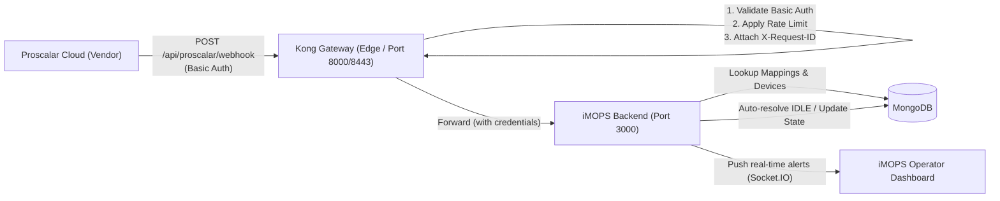
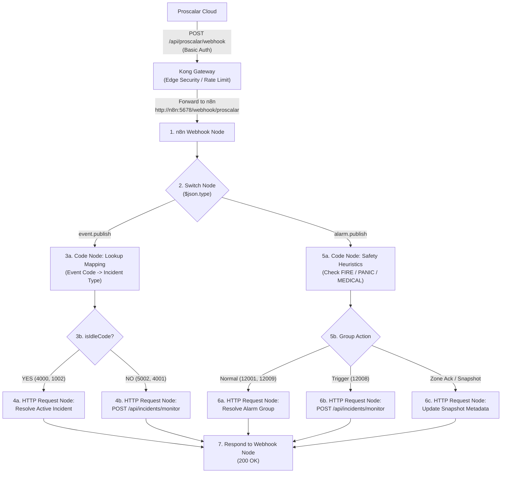

# Kong Gateway & n8n Integration Instructions: Proscalar Ingestion

This document provides complete instructions for configuring **Kong Gateway** in front of **iMOPS Lite** to ingest vendor webhooks from **Proscalar**. It covers two architectural approaches:
* **PART 1 (Option A):** Kong Gateway Perimeter (Direct iMOPS Adapter — Zero Backend Code Changes)
* **PART 2 (Option C):** Kong Gateway + n8n Visual Workflow Engine Pattern

---

# PART 1: Option A — Kong Gateway Perimeter (Direct iMOPS Adapter)

## 1. Architecture Overview

In this pattern, Kong acts as a hardened perimeter gateway. It terminates external connections, authenticates incoming requests, enforces rate limits and security policies, and forwards verified traffic directly to the existing iMOPS webhook route.



### Key Benefits

- **Zero iMOPS Code Changes:** By preserving incoming authentication headers (`hide_credentials: false`), the backend logic in `routes/proscalar.js` continues to function as implemented and tested.
- **Perimeter Defense:** Kong absorbs invalid authentication attempts, DoS floods, and oversized payloads before they reach Node.js.
- **Observability:** Centralized metrics, correlation IDs, and access logging at the gateway layer.

---

## 2. Declarative Configuration (`kong.yml` / DB-less Mode)

If using Kong in **declarative (DB-less)** mode, place this configuration in your Kong deployment (e.g., `/etc/kong/kong.yml`):

```yaml
_format_version: '3.0'

# ═══════════════════════════════════════════════════════════════════════════
# SERVICES & ROUTES
# ═══════════════════════════════════════════════════════════════════════════
services:
  - name: imops-proscalar-service
    # URL to the internal iMOPS backend service inside the Docker/K8s network
    url: http://backend:3000/api/proscalar/webhook
    connect_timeout: 5000
    write_timeout: 10000
    read_timeout: 10000
    routes:
      - name: proscalar-webhook-route
        paths:
          - /api/proscalar/webhook
        methods:
          - POST
        strip_path: false
        protocols:
          - http
          - https

    plugins:
      # 1. Edge Basic Authentication
      - name: basic-auth
        config:
          hide_credentials: false # CRITICAL: Retains Authorization header for iMOPS backend validation
          anonymous: null

      # 2. Rate Limiting (Prevents alert flooding / DDoS)
      - name: rate-limiting
        config:
          minute: 120
          hour: 3000
          policy: local
          fault_tolerant: true
          hide_client_headers: false

      # 3. Request Size Restriction (Rejects oversized payloads)
      - name: request-size-limiting
        config:
          allowed_payload_size: 5 # Limit to 5 MB

      # 4. Distributed Tracing & Correlation ID
      - name: correlation-id
        config:
          header_name: X-Request-ID
          generator: uuid
          echo_downstream: true

      # 5. (Optional) IP Restriction: Allow only Proscalar static IP ranges
      # - name: ip-restriction
      #   config:
      #     allow:
      #       - 203.0.113.0/24
      #       - 198.51.100.50

# ═══════════════════════════════════════════════════════════════════════════
# CONSUMERS & CREDENTIALS
# ═══════════════════════════════════════════════════════════════════════════
consumers:
  - username: proscalar_webhook_client
    custom_id: vendor-proscalar-tu
    basicauth_credentials:
      - username: proscalar@gmail.com
        password: '${PROSCALAR_PASS}' # Injected via environment or vault secret
```

---

## 3. Alternative: Provisioning via Kong Admin API (cURL Commands)

If you are using Kong with a database (PostgreSQL) or administering it via the **Admin API** (`http://kong-admin:8001`), run these commands:

### Step 1: Create the Upstream Service

```bash
curl -i -X POST http://localhost:8001/services \
  --data name=imops-proscalar-service \
  --data url=http://backend:3000/api/proscalar/webhook
```

### Step 2: Create the Route

```bash
curl -i -X POST http://localhost:8001/services/imops-proscalar-service/routes \
  --data name=proscalar-webhook-route \
  --data 'paths[]=/api/proscalar/webhook' \
  --data 'methods[]=POST' \
  --data strip_path=false
```

### Step 3: Enable Basic Auth Plugin

```bash
curl -i -X POST http://localhost:8001/routes/proscalar-webhook-route/plugins \
  --data name=basic-auth \
  --data config.hide_credentials=false
```

### Step 4: Enable Rate Limiting Plugin

```bash
curl -i -X POST http://localhost:8001/routes/proscalar-webhook-route/plugins \
  --data name=rate-limiting \
  --data config.minute=120 \
  --data config.policy=local
```

### Step 5: Enable Correlation ID Plugin

```bash
curl -i -X POST http://localhost:8001/routes/proscalar-webhook-route/plugins \
  --data name=correlation-id \
  --data config.header_name=X-Request-ID \
  --data config.generator=uuid \
  --data config.echo_downstream=true
```

### Step 6: Create Consumer & Credentials

```bash
# Create Consumer
curl -i -X POST http://localhost:8001/consumers \
  --data username=proscalar_webhook_client \
  --data custom_id=vendor-proscalar-tu

# Attach Basic Auth credentials
curl -i -X POST http://localhost:8001/consumers/proscalar_webhook_client/basic-auth \
  --data username=proscalar@gmail.com \
  --data password="YOUR_SECURE_PROSCALAR_PASSWORD"
```

---

## 4. Docker Compose Setup (Kong DB-less Mode)

To run Kong Gateway in DB-less mode directly alongside the iMOPS stack in `docker-compose.yml`:

```yaml
version: '3.8'

services:
  kong-gateway:
    image: kong:3.4-alpine
    container_name: kong-gateway
    restart: unless-stopped
    environment:
      KONG_DATABASE: 'off'
      KONG_DECLARATIVE_CONFIG: /etc/kong/kong.yml
      KONG_PROXY_ACCESS_LOG: /dev/stdout
      KONG_ADMIN_ACCESS_LOG: /dev/stdout
      KONG_PROXY_ERROR_LOG: /dev/stderr
      KONG_ADMIN_ERROR_LOG: /dev/stderr
      KONG_ADMIN_LISTEN: 0.0.0.0:8001
      KONG_PROXY_LISTEN: 0.0.0.0:8000, 0.0.0.0:8443 ssl
      PROSCALAR_PASS: ${PROSCALAR_PASS:-proscalar_secure_pass_123}
    volumes:
      - ./docker/kong.yml:/etc/kong/kong.yml:ro
    ports:
      - '8000:8000' # HTTP Ingress Proxy
      - '8443:8443' # HTTPS Ingress Proxy
      - '127.0.0.1:8001:8001' # Admin API (Internal only)
    depends_on:
      - backend
    networks:
      - imops-network

networks:
  imops-network:
    driver: bridge
```

---

## 5. Verification & Testing

Run these tests against the Kong Gateway proxy port (default `8000` or `8443`):

### Test 1: Unauthorized Request (Should return 401 from Kong)

```bash
curl -i -X POST http://localhost:8000/api/proscalar/webhook \
  -H "Content-Type: application/json" \
  -d '{"type":"event.publish"}'
```

- **Expected Result:** `HTTP/1.1 401 Unauthorized` generated directly by Kong (Node.js backend is untouched).

---

### Test 2: Valid Active Event (Should create incident)

```bash
curl -i -X POST http://localhost:8000/api/proscalar/webhook \
  -u "proscalar@gmail.com:YOUR_SECURE_PROSCALAR_PASSWORD" \
  -H "Content-Type: application/json" \
  -d '{
    "type": "event.publish",
    "timestamp": "2026-06-09T03:00:00.000Z",
    "data": {
      "id": "kong-test-event-01",
      "eventTimestamp": "2026-06-09T02:59:58.000Z",
      "eventCode": "5002",
      "eventSourceId": "proscalar-test-source-id",
      "eventSourceName": "OT-CTR-MAIN GATE",
      "eventPointId": "proscalar-test-point-id",
      "eventPointName": "OT-MAIN GATE",
      "message": "Logical Door Forced Open ACTIVE."
    }
  }'
```

- **Expected Result:** `HTTP/1.1 200 OK` with JSON `{ "success": true, "forwardResult": { ... } }` and response header `X-Request-ID`.
- Check iMOPS operator dashboard: **Door Force Opened** active incident appears with SOP checklist.

---

### Test 3: Auto-Resolution IDLE Event (Should resolve active incident)

```bash
curl -i -X POST http://localhost:8000/api/proscalar/webhook \
  -u "proscalar@gmail.com:YOUR_SECURE_PROSCALAR_PASSWORD" \
  -H "Content-Type: application/json" \
  -d '{
    "type": "event.publish",
    "timestamp": "2026-06-09T03:05:00.000Z",
    "data": {
      "id": "kong-test-event-02",
      "eventTimestamp": "2026-06-09T03:04:58.000Z",
      "eventCode": "4000",
      "eventSourceId": "proscalar-test-source-id",
      "eventSourceName": "OT-CTR-MAIN GATE",
      "eventPointId": "proscalar-test-point-id",
      "eventPointName": "CV485",
      "message": "Logical Reader Tamper IDLE."
    }
  }'
```

- **Expected Result:** `HTTP/1.1 200 OK` with JSON `{ "success": true, "message": "Incident automatically resolved successfully" }`.

---

### Test 4: Rate Limiting Enforcement

Send > 120 requests within 1 minute:

- **Expected Result:** `HTTP/1.1 429 Too Many Requests` returned by Kong with `RateLimit-Remaining: 0`.

---

## 6. Checklist & Summary (Option A)

- [x] Kong handles edge Basic Auth validation.
- [x] Kong retains `Authorization` header (`hide_credentials: false`) so iMOPS backend needs zero code changes.
- [x] Rate limiting protects backend from webhook storms.
- [x] Correlation IDs (`X-Request-ID`) trace logs across Kong and backend.
- [x] Backend handles all stateful logic: DB lookup tables, device matching, IDLE auto-resolution, and Socket.IO broadcasts.

---
---

# PART 2: Option C — Kong Gateway + n8n Workflow Engine Pattern

Option C shifts the webhook payload ingestion, routing, and normalization logic from the Node.js backend into an **n8n visual workflow**, while Kong remains the perimeter gatekeeper.



---

### 7.1 Workflow Architecture: How Many Workflows to Create?

You have two structural approaches in n8n:

#### Approach 1: 1 Single Unified Workflow (Recommended ⭐)
* **Count:** **1 Workflow**
* **Why:** Proscalar only targets **one single incoming webhook endpoint URL**. Having all logic in one canvas provides the lowest latency, eliminates inter-workflow messaging overhead, and allows visual end-to-end tracing of every alarm event in one execution log.
* **Nodes Required (~8–10 nodes):**
  1. `Webhook Trigger Node`: Ingests payload from Kong.
  2. `Switch Node`: Routes `event.publish` vs. `alarm.publish`.
  3. `Code Node (Event Code Map)`: Evaluates `eventCode` against lookup table and checks `isIdleCode`.
  4. `IF Node (Idle vs Active)`: Directs to resolution or creation.
  5. `Code Node (Safety Heuristic)`: Evaluates `accessZones` array for `FIRE`, `PANIC`, `MEDICAL`.
  6. `HTTP Request Node (Create Incident)`: Dispatches to `POST /api/incidents/monitor`.
  7. `HTTP Request Node (Resolve Incident)`: Auto-closes active incident in iMOPS.
  8. `Respond to Webhook Node`: Returns `{ "success": true }`.

#### Approach 2: 3 Modular Workflows (Enterprise Sub-Workflow Pattern)
If you prefer strict separation of concerns:
* **Workflow 1: Ingestor & Router** (Receives webhook from Kong, validates envelope, calls sub-workflow via *Execute Workflow* node).
* **Workflow 2: Point & Tamper Processor** (Dedicated to single-device access, tamper, and hardware events).
* **Workflow 3: Alarm Group & Fire Processor** (Dedicated to multi-zone aggregation, fire safety rules, and ACK states).

---

### 7.2 Kong Configuration for Option C (`kong.yml`)

In Option C, Kong routes the external webhook directly to the n8n webhook service instead of the Node.js backend:

```yaml
_format_version: "3.0"

services:
  - name: n8n-proscalar-service
    # Upstream pointing to internal n8n container
    url: http://n8n:5678/webhook/proscalar
    connect_timeout: 5000
    write_timeout: 10000
    read_timeout: 10000
    routes:
      - name: proscalar-n8n-route
        paths:
          - /api/proscalar/webhook
        methods:
          - POST
        strip_path: true
    plugins:
      # Edge Basic Auth (validates vendor credentials at the perimeter)
      - name: basic-auth
        config:
          hide_credentials: true  # Strips vendor credentials before forwarding to n8n
      # Rate Limiting
      - name: rate-limiting
        config:
          minute: 120
          policy: local
      # Inject internal service token for n8n to call iMOPS API
      - name: request-transformer
        config:
          add:
            headers:
              - "X-Source: Kong-Proscalar-Gateway"

consumers:
  - username: proscalar_webhook_client
    basicauth_credentials:
      - username: proscalar@gmail.com
        password: "${PROSCALAR_PASS}"
```

---

### 7.3 Detailed n8n Node Logic & Code Snippets

#### 1. Code Node: Event Code Lookup & Classification (`event.publish`)
```javascript
// n8n Code Node for event.publish
const data = $json.data || {};
const eventCode = String(data.eventCode || '');

// Proscalar code mappings
const mappingTable = {
  "5001": { incidentType: "door_held_open", severity: "medium", isIdle: false },
  "5002": { incidentType: "door_forced_open", severity: "high", isIdle: false },
  "4001": { incidentType: "reader_tamper", severity: "high", isIdle: false },
  "4000": { incidentType: "reader_tamper", severity: "low", isIdle: true, pairCode: "4001" },
  "1003": { incidentType: "panel_tamper", severity: "critical", isIdle: false },
  "1002": { incidentType: "panel_tamper", severity: "low", isIdle: true, pairCode: "1003" },
  "1000": { incidentType: "power_failure", severity: "high", isIdle: false },
  "5014": { incidentType: "emergency_exit", severity: "critical", isIdle: false },
  "5015": { incidentType: "emergency_exit", severity: "low", isIdle: true, pairCode: "5014" }
};

const mapping = mappingTable[eventCode] || { incidentType: "invalid_credential", severity: "medium", isIdle: false };

return [{
  json: {
    eventCode,
    isIdleCode: mapping.isIdle,
    activePairCode: mapping.pairCode || null,
    incidentType: mapping.incidentType,
    severity: mapping.severity,
    deviceName: data.eventPointName || data.eventSourceName || "Proscalar Device",
    title: `${data.message || mapping.incidentType} - ${data.eventPointName || 'Proscalar'}`,
    eventSourceId: data.eventSourceId,
    eventPointId: data.eventPointId,
    rawData: data
  }
}];
```

#### 2. Code Node: Alarm Group Safety Heuristics (`alarm.publish`)
```javascript
// n8n Code Node for alarm.publish
const data = $json.data || {};
const groupCode = String(data.groupEventCode || '');
const accessZones = data.accessZones || [];

// Check resolution codes
const isResolution = ['12001', '12009', '12015'].includes(groupCode);

// Safety Priority Heuristics
const isFire = accessZones.some(z => z.type === 'FIRE');
const isPanic = accessZones.some(z => z.type === 'PANIC');
const isMedical = accessZones.some(z => z.type === 'MEDICAL');

let incidentType = 'group_alarm';
if (isFire) incidentType = 'fire_alarm';
else if (isPanic) incidentType = 'panic_alarm';
else if (isMedical) incidentType = 'medical_alarm';

// Check if all non-safety zones are acknowledged
const allAck = accessZones.length > 0 && accessZones.every(z => z.state === 'ACKNOWLEDGED');

return [{
  json: {
    alarmGroupId: data.alarmGroupId,
    groupEventCode: groupCode,
    isResolution,
    isTrigger: groupCode === '12008',
    isSafetyCategory: (isFire || isPanic || isMedical),
    allAck,
    incidentType,
    severity: (isFire || isPanic || isMedical || groupCode === '12008') ? 'critical' : 'medium',
    title: `${data.name || 'ALARM GROUP'} - ${incidentType.toUpperCase()}`,
    deviceName: data.eventSourceName || data.name || "Alarm Monitoring Group",
    rawData: data
  }
}];
```

#### 3. HTTP Request Node: Create Active Incident
* **Method:** `POST`
* **URL:** `http://backend:3000/api/incidents/monitor`
* **Authentication:** Header `Authorization: Bearer {{ $env.INTERNAL_SERVICE_JWT }}`
* **Body (JSON):**
```json
{
  "incidentType": "={{ $json.incidentType }}",
  "deviceName": "={{ $json.deviceName }}",
  "title": "={{ $json.title }}",
  "severity": "={{ $json.severity }}",
  "preResolved": true,
  "mode": "incident",
  "metadata": {
    "proscalar_event_code": "={{ $json.eventCode }}",
    "proscalar_alarm_group_id": "={{ $json.alarmGroupId }}",
    "proscalar_raw_data": "={{ $json.rawData }}"
  }
}
```

---

### 7.4 Summary Comparison: Option A vs. Option C

| Feature | Option A (Kong + Backend Adapter) | Option C (Kong + n8n Workflow) |
| :--- | :--- | :--- |
| **Workflows to Manage** | **0** (Code already implemented & tested) | **1 unified workflow** (or 3 modular workflows) |
| **iMOPS Code Changes** | **None** | Minor (need an explicit incident resolution API endpoint if not modifying DB directly) |
| **Alarm Dispatch Latency** | **< 20 ms** (Optimal for Fire & Tamper alarms) | **150 ms – 400 ms** (Node pipeline overhead in n8n) |
| **Visual Debugging** | Container logs & DB AuditLog | n8n visual execution logs per webhook |
| **Failure Surface** | Kong $\rightarrow$ iMOPS (2 services) | Kong $\rightarrow$ n8n $\rightarrow$ iMOPS (3 services) |

---

## 8. Option C Operational Runbook & Production Artifacts

The Option C integration is fully implemented and operational in this repository.

### 8.1 Repository Deliverables

| Artifact | Path | Description |
| :--- | :--- | :--- |
| **Kong Setup (PowerShell)** | [`apigw/scripts/setup_proscalar_n8n.ps1`](file:///c:/Projects/cde/apigw/scripts/setup_proscalar_n8n.ps1) | Automated script provisioning Service, Route, 5 Edge Plugins, and Consumer Credentials |
| **Kong Setup (Bash)** | [`apigw/scripts/setup_proscalar_n8n.sh`](file:///c:/Projects/cde/apigw/scripts/setup_proscalar_n8n.sh) | Linux / CI-CD equivalent setup script |
| **n8n Workflow Definition** | [`n8n/workflows/proscalar_ingestion_workflow.json`](file:///c:/Projects/cde/n8n/workflows/proscalar_ingestion_workflow.json) | Complete exportable visual workflow with event/alarm branching and classification |
| **Verification Suite (PowerShell)** | [`apigw/scripts/test_proscalar_n8n.ps1`](file:///c:/Projects/cde/apigw/scripts/test_proscalar_n8n.ps1) | Automated 5-point end-to-end verification test suite |
| **Verification Suite (Bash)** | [`apigw/scripts/test_proscalar_n8n.sh`](file:///c:/Projects/cde/apigw/scripts/test_proscalar_n8n.sh) | cURL-based test suite for Linux / Git Bash |

---

### 8.2 Deployment & Provisioning Instructions

#### Step 1: Provision Kong Perimeter Ingress
Run the automated provisioning script to register the Service, Route, and Edge Security Plugins on Kong:
```powershell
powershell -ExecutionPolicy Bypass -File c:\Projects\cde\apigw\scripts\setup_proscalar_n8n.ps1
```
*(Or via Bash: `bash c:/Projects/cde/apigw/scripts/setup_proscalar_n8n.sh`)*

#### Step 2: Publish n8n Pipeline
The workflow is stored in `n8n/workflows/proscalar_ingestion_workflow.json` and activated inside the n8n container:
```bash
docker cp c:\Projects\cde\n8n\workflows\proscalar_ingestion_workflow.json n8n-server:/tmp/proscalar_ingestion_workflow.json
docker exec n8n-server n8n import:workflow --input=/tmp/proscalar_ingestion_workflow.json
docker exec n8n-server n8n publish:workflow --id=proscalar-pipeline-v1
docker restart n8n-server
```

---

### 8.3 Verification & Testing

#### Method A: Automated Test Suite (1-Click)
Run the automated test runner in PowerShell:
```powershell
powershell -ExecutionPolicy Bypass -File c:\Projects\cde\apigw\scripts\test_proscalar_n8n.ps1
```
*(Or via Bash: `bash c:/Projects/cde/apigw/scripts/test_proscalar_n8n.sh`)*

This tests:
- **Test 1:** Unauthorized Rejection (`HTTP 401 Unauthorized` directly from Kong).
- **Test 2:** Active Point Alert (`Code 5002 - Door Forced Open` -> incident created).
- **Test 3:** IDLE Auto-Resolution (`Code 4000 - Reader Tamper IDLE` -> incident resolved).
- **Test 4:** Alarm Group Safety Event (`Code 12008 with FIRE Zone` -> CRITICAL incident).
- **Test 5:** Gateway Rate Limiting (`120 req/min` threshold throttled with `HTTP 429`).

---

#### Method B: Manual Step-by-Step cURL Verification

##### Test 1: Perimeter Security (Unauthorized Request)
Verify Kong blocks unauthenticated calls without forwarding downstream:
```bash
curl.exe -i -X POST http://localhost:8088/api/proscalar/webhook \
  -H "Content-Type: application/json" \
  -d "{\"type\":\"event.publish\"}"
```
* **Expected Result:** `HTTP/1.1 401 Unauthorized` with `Server: kong/3.9.3` and an `X-Request-ID` header.

---

##### Test 2: Active Alert (Door Forced Open — Code `5002`)
Send an active single-device event:
```bash
curl.exe -i -X POST http://localhost:8088/api/proscalar/webhook \
  -u "proscalar@gmail.com:fwpkyjcf2i8fcoP05yEz" \
  -H "Content-Type: application/json" \
  -d "{
    \"type\": \"event.publish\",
    \"timestamp\": \"2026-10-07T05:00:00.000Z\",
    \"data\": {
      \"id\": \"evt-door-01\",
      \"eventTimestamp\": \"2026-10-07T04:59:58.000Z\",
      \"eventCode\": \"5002\",
      \"eventSourceId\": \"proscalar-src-1\",
      \"eventSourceName\": \"OT-CTR-MAIN GATE\",
      \"eventPointId\": \"proscalar-pt-1\",
      \"eventPointName\": \"OT-MAIN GATE\",
      \"message\": \"Logical Door Forced Open ACTIVE.\"
    }
  }"
```
* **Expected Result:** `HTTP/1.1 200 OK` with `{ "success": true, "pipeline": "Option C (Kong Gateway + n8n)", "executionId": "..." }`.
* **Backend Outcome:** Incident created in iMOPS backend (`Door Force Opened`), tagged to Taylor's University, with SOP checklist and real-time Socket.IO alert broadcast.

---

##### Test 3: Auto-Resolution Event (Reader Tamper IDLE — Code `4000`)
Send an IDLE restoration code:
```bash
curl.exe -i -X POST http://localhost:8088/api/proscalar/webhook \
  -u "proscalar@gmail.com:fwpkyjcf2i8fcoP05yEz" \
  -H "Content-Type: application/json" \
  -d "{
    \"type\": \"event.publish\",
    \"timestamp\": \"2026-10-07T05:05:00.000Z\",
    \"data\": {
      \"id\": \"evt-tamper-idle-01\",
      \"eventTimestamp\": \"2026-10-07T05:04:58.000Z\",
      \"eventCode\": \"4000\",
      \"eventSourceId\": \"proscalar-src-1\",
      \"eventSourceName\": \"OT-CTR-MAIN GATE\",
      \"eventPointId\": \"proscalar-pt-1\",
      \"eventPointName\": \"CV485\",
      \"message\": \"Logical Reader Tamper IDLE.\"
    }
  }"
```
* **Expected Result:** `HTTP/1.1 200 OK`. Active incident matching pair code `4001` is marked resolved in iMOPS.

---

##### Test 4: Critical Multi-Zone Fire Alarm Group (Code `12008` with `FIRE` Zone)
Send an aggregated multi-zone alarm to test safety priority heuristics:
```bash
curl.exe -i -X POST http://localhost:8088/api/proscalar/webhook \
  -u "proscalar@gmail.com:fwpkyjcf2i8fcoP05yEz" \
  -H "Content-Type: application/json" \
  -d "{
    \"type\": \"alarm.publish\",
    \"timestamp\": \"2026-10-07T05:10:00.000Z\",
    \"data\": {
      \"alarmGroupId\": \"GRP-FIRE-EAST-01\",
      \"groupEventCode\": \"12008\",
      \"name\": \"EAST WING FIRE CLUSTER\",
      \"eventSourceName\": \"East Wing Panel 1\",
      \"accessZones\": [
        { \"name\": \"East Lobby\", \"type\": \"NORMAL\", \"state\": \"ACTIVE\" },
        { \"name\": \"Server Room A\", \"type\": \"FIRE\", \"state\": \"TRIGGERED\" }
      ]
    }
  }"
```
* **Expected Result:** `HTTP/1.1 200 OK`. n8n classifies the event as `fire_alarm` with `CRITICAL` severity and dispatches an immediate high-priority alarm.

---

### 8.4 Visual Dashboard & Observability Verification

1. **Kong Manager UI**:
   - Access: **[http://localhost:8002](http://localhost:8002)**
   - View **Services** $\rightarrow$ `imops-proscalar-n8n-service` $\rightarrow$ **Routes** & **Plugins** to verify traffic counters, rate limit quotas, and latency metrics.

2. **n8n Workflow Execution Canvas**:
   - Access: **[https://localhost:5678](https://localhost:5678)**
   - Click **Executions** in the left sidebar to see visual node-by-node execution graphs for each incoming webhook payload, timing benchmarks, and input/output JSON schemas.

3. **Live Container Logs**:
   ```bash
   # Kong Gateway Access & Error Logs
   docker logs -f kong-gateway

   # n8n Pipeline Logs
   docker logs -f n8n-server

   # iMOPS Backend Incident Monitor & Socket.IO Logs
   docker logs -f imops-backend
   ```


